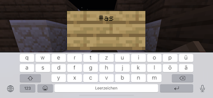
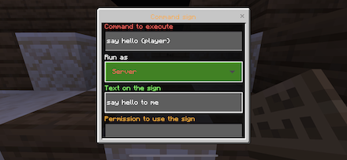
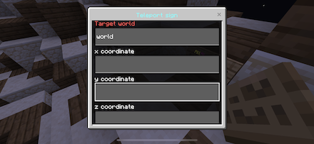

    

<h1 align="center">AllSigns</h1>

Turn signs into World Teleport and Command Signs

 

    
    
    
    
    
    

##

    

[• Description](#-description)  
[• Features](#-features)  
[• Usage](#-usage)  
[• Command Signs](#%EF%B8%8F-command-signs)  
[• Teleport Signs](#-teleport-signs)  
[• Contribution](#-contribution)  
[• License](#%EF%B8%8F-license)

## 📙 Description
With AllSigns, you can easily create signs which are executing commands or teleporting players into another world/to coordinates when they tap on them.
It provides an easy-to-use GUI to create the signs.

## 🎁 Features
- **COMMAND SIGNS** Signs executing commands when players tap them
- **TELEPORT SIGNS** Signs teleporting players in a specific world/coordinates when they tap them
- **USABILITY** Easy to use with in-game form windows, no need to use commands or edit config files

## 🖱 Usage
Please see the [full documentation 📖](https://plugins.surva.net/docs/AllSigns) for a detailed description of all features.

To create a new AllSign, place a sign and write `#as` into the first line. A form wizard will open where you can configure all settings for the sign.

### ⌨️ Command Signs
To create a command sign which executes a specific command when a player touches it, just create a sign like described above.

### 🌎 Teleport Signs
To create a world sign which teleports a player to a specific world or coordinates, create a sign like described above.

To edit a sign, touch it with a golden pickaxe. If you want to remove a sign, just break it.

[Read the full documentation 📖](https://plugins.surva.net/docs/AllSigns) • [Ask questions on Discord 💬](https://discord.gg/t4Kg4j3829)

## 🚧 Upgrade from v1
The second version of AllSigns is a complete rewrite of the plugin. Because of fundamental changes in the way how the plugin works, an upgrade from v1 is not supported, meaning all signs created in v1 need to be re-created.

If you want to [upgrade to v2](https://plugins.surva.net/docs/AllSigns/#upgradev1), please delete all config files of the plugin first by deleting the plugin_data/AllSigns folder in the PocketMine directory. You can then just replace the PHAR-file of the plugin and start using v2.

## 🙋‍ Contribution
Feel free to contribute if you have ideas or found an issue.

You can:
- [open an issue](https://github.com/survanetwork/AllSigns/issues) (problems, bugs or feature requests)
- [create a pull request](https://github.com/survanetwork/AllSigns/pulls) (code contributions like fixed bugs or added features)
- [help translating the plugin](https://www.transifex.com/surva/allsigns) (help us to translate this plugin into your language on Transifex platform)

Please read our **[Contribution Guidelines](CONTRIBUTING.md)** before creating an issue or submitting a pull request.

Many thanks for their support to all contributors!

## 👨‍⚖️ License
[MIT](https://github.com/survanetwork/AllSigns/blob/master/LICENSE)
